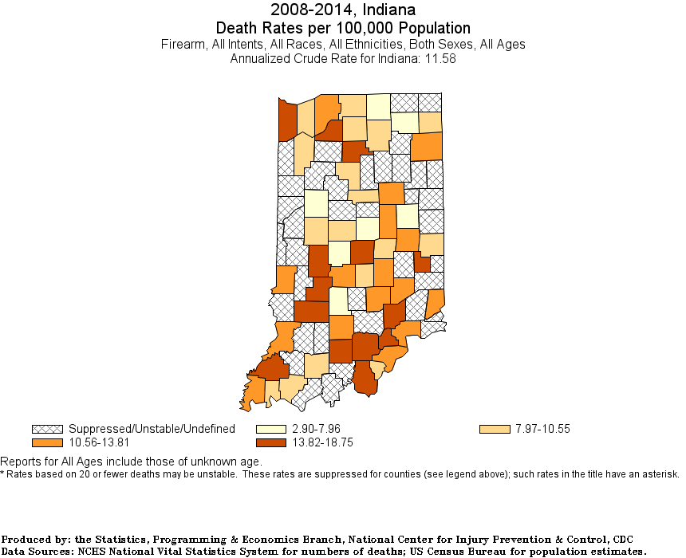

### Group E - Gabriel New, Maria Quinton, Jeremy Najera
1. A brief articulation of your chosen topic and rationale
   - We chose to analyze gun sales in the United States and how it affects gun violence. Our rationale in choosing this topic was the current political, economic and social climates in the U.S.
2. A link to your data set(s) and a screenshot of the metadata if it exists
   - [Firearms Background Checks](https://github.com/BuzzFeedNews/nics-firearm-background-checks/blob/master/data/nics-firearm-background-checks.csv)
   - [Gun Violence Data](https://www.kaggle.com/jameslko/gun-violence-data)
      - 
   - [NICS Gun Purchase Background Checks](https://cran.r-project.org/web/packages/gunsales/README.html)
   - [Firearms Commerce in the United States](datasets/firearms_commerce_us.pdf)
   - [CDC - Firearm Mortality in the US](https://www.cdc.gov/nchs/pressroom/sosmap/firearm_mortality/firearm.htm)
3. 3 or 4 screenshots of relevant, ‘inspiring’ visualizations that frame your creative fodder
   - 
      - Heat Map
   - 
      - Interactive Pop-up Map
   - 
      - Stacked Bar Chart, gun sales vs. gun violence
   - 
      - Map of gun deaths by state
   - 
      - Close up on IN
4. A sketch of the final design
   - Clean-up and align our datasets
   - Upload into our database of choice
   - Create and map our data into interactive visualizations
   - Form conclusion
5. A link to the primary GitHub repository you’ll be housing your work in.
   -[GitHub Repo](https://github.com/Mquinton28/Project-2---Group-E)
